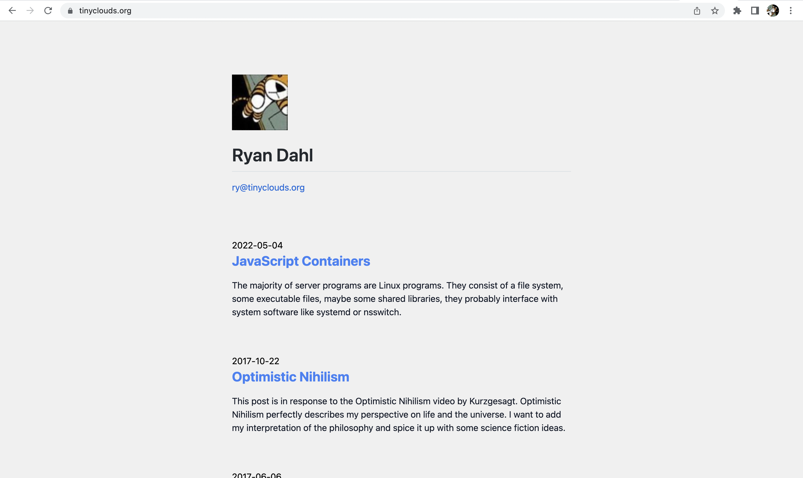

# Ryan's Blog

To get it running:

```sh
git clone git@github.com:ry/tinyclouds.git blog
cd blog
deno task dev
```

To deploy it to Deno Deploy - clone it in a github repo and create and link a
new project on https://dash.deno.com.
