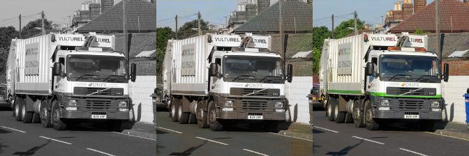
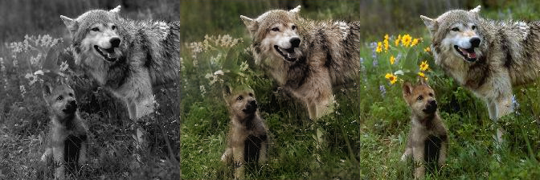
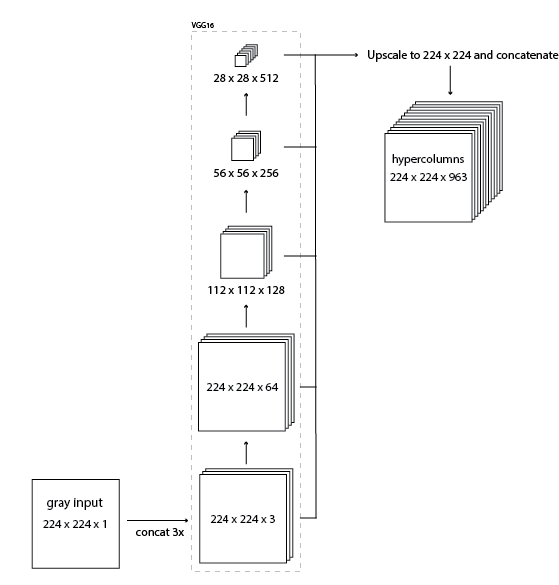
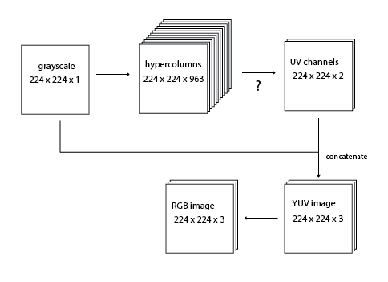
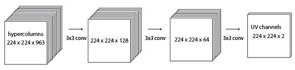
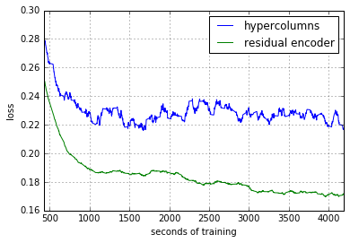
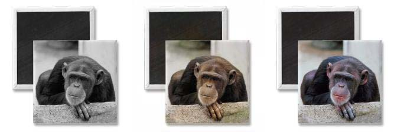
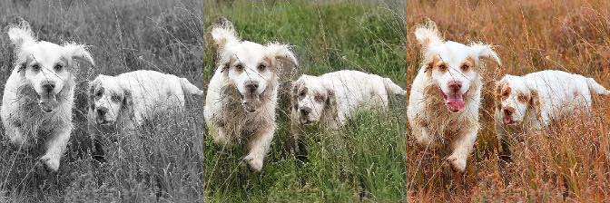

Have you seen Reddit's
<a href="https://www.reddit.com/r/Colorization">/r/colorization</a> sub? People
use photoshop to add color to old black and white photos. This is a good problem
to automate because perfect training data is easy to get: any color image can be
desaturated and used as an example.

This project is an attempt to use modern deep learning techniques to
automatically colorize black and white photos.

In the past few years
<a
href="https://en.wikipedia.org/wiki/Convolutional_neural_network">Convolutional
Neural Networks</a> (CNNs) have revolutionized the field of computer vision.
Each year the ImageNet Challenge (ILSVRC) has seen plummeting error rates due to
the ubiquitous adoption of CNN models amongst the contestants.\
As of this year classification error in the ILSVRC is thought to be better than
humans.
<a
href="http://googleresearch.blogspot.com/2015/06/inceptionism-going-deeper-into-neural.html">Amazing</a>
<a href="http://arxiv.org/abs/1508.06576">visualizations</a> have shown that
pre-trained classification models can be retooled for other purposes.

## Motivation To Read Further

Here are some of my best colorizations after about three days of training. The
input to the model is the left-side grayscale image. The output is the middle
image. The right image is the true color&mdash;which the model never gets to
see. (These are images are from the validation set.)

There are bad cases too, which mostly look black and white or
<a href="https://en.wikipedia.org/wiki/Photographic_print_toning">sepia
toned</a>.

<a href="val-imgs/">Here</a> are a bunch of random validation images if you're
interested in getting a better idea of its competence. The image files are named
after the training iteration that they're from. So higher numbered will have
better color.

From here on I'm going to assume you have some familiarity with how CNNs work.
For a great introduction check out
<a href="http://cs231n.github.io/convolutional-networks/">Karpathy's CS231n</a>.

## Hypercolumns

In CNN classification models (like the ones made for ILSVRC), more info can be
extracted than just the final classification.
<a
href="http://arxiv.org/abs/1311.2901">Zeiler and Fergus</a> showed how to
visualize what intermediate layers of a CNN could represent&mdash;and it turns
out that objects like car wheels and people already start becoming identifable
by layer three. Intermediate layers in classification models can provide useful
color information.

First order of business was picking a pre-trained model to use.

So I wanted to use a pretrained image classification model (from
<a
href="https://github.com/BVLC/caffe/wiki/Model-Zoo">the Caffe model zoo</a>)
to extract features for colorization. I chose the
<a
href="https://gist.github.com/ksimonyan/211839e770f7b538e2d8#file-readme-md">VGG-16
model</a> because it has a simple architecure yet still competitive (second
place in 2014 ILSVRC).
<a href="http://arxiv.org/abs/1411.5752">This paper</a> introduces the idea of
"hypercolumns" in a CNN. A hypercolumn for a pixel in the input image is a
vector of all the activations above that pixel. The way I implemented this was
by forwarding an image thru the VGG network and then extracting a few layers
(specifically the tensors before each of the first 4 max-pooling operations),
upscaling them to the original image size, and concatinating them all together.

The resulting hypercolumn tensor has tons of information about what's in that
image. Using this information I should be able to color the image.

Rather than reconstructing the entire color RGB image, I trained models to
produce two color channels which I concatenate with the grayscale input channel
to produce a <a
href="https://en.wikipedia.org/wiki/YUV">YUV image</a>. The Y
channel is intensity. This ensures that the intensity of the output will always
be the same as the input. (This extra complexity isn't necessary, a model could
learn to reconstruct the image entirely, but learning only two channels helps
debugging.)

Originally I used Hue-Saturation-Value (HSV) color space. (As it was the only
color space with a grayscale channel that I knew about.) The problem with HSV is
that the hue channel wraps around. (0, x, y) maps to the same RGB pixel as (1,
x, y). This makes the loss function more complex than a Euclidean distance. I'm
also not sure if this circular property of hue would screw up the gradient
decent&mdash;I decided to avoid it. Also YUV's conversion formula to and from
RGB is just a matrix multiplication, HSV is more complex.

What to use for the question mark operation? The simplest thing to do would use
a 1x1 convolution from 963 channels to 2 channels. That is, multiply each
hypercolumn by a (963, 2) matrix and add a 2D bias vetor, and pass thru a
sigmoid. Unfortuantely that model is not complex enough to represent the colors
in ImageNet. It will converge to desaturated images.

I tried various hidden layers and larger convolutions, but before I get into
that, I want to talk about the loss and some other choices.

<h2>Loss</h2>

The most obvious loss function is a Euclidean distance function between the
network RGB output image and the true color RGB image. This works to some extent
but I found models converged faster when I used a more complex loss function.

Blurring the network output and the true color image and doing Euclidean
distance seems to give the gradient decent help. (I ended up averaging the
normal rgb distance and two blur distances with 3 and 5 pixel gaussian kernels.

Also I only calculuate the distance in UV space. Here's the
<a
href="https://gist.github.com/ry/148158137a1346eaea8e">exact code</a>.

## Network Architecture

I use ReLUs as activation functions throughout except at the last output to UV
channels&mdash;there I use a sigmoid to squash values between 0 and 1. I use
<a
href="https://github.com/ry/deep_learning_glossary#batch-normialization-bn">batch
norm</a> (BN) instead of bias terms behind every convolution. I experiemented
with using
<a
href="https://github.com/ry/deep_learning_glossary#exponential-linear-units-elus">ELUs</a>
instead of and in addition to BN, but with limited success. I did not experience
great gains with leaky ReLUs. I experiemented using dropout in various places,
but it didn't seem to help much. A learning rate of 0.1 was used with standard
SGD. No weight decay.

Models were trained on the
<a
href="http://academictorrents.com/details/a306397ccf9c2ead27155983c254227c0fd938e2/tech">ILSVRC
2012</a> classification training dataset. The same training set used for the
pretrained VGG16. It's 147GB and over 1.2 million images!

I experiemented with many different architectures for transforming the
hypercolumns into UV channels. The one I will compare here is two hidden layers
with depth at 128 and 64, 3x3 stride 1 convolutions between them.

This model might have enough complexity to learn the colors in ImageNet. But I
never spent enough time to train it fully because I found a better setup. I
guess the problem with this model will be immediately obvious to anyone who has
worked with CNNs before. It was not to me.

Unlike in classification models there is no max pooling. I need the output to be
at full 224 x 224 resolution. The hypercolumns and the susequent 128 depth layer
take up a lot of memory! I was only able to run a model like this 1 image per
batch on my 2 gig NVIDIA GTX 750ti.

I came up with a new model that I'm calling a "residual encoder" - because it's
almost an autoencoder but from black and white to color, with residual
connections. The model forwards a grayscale image thru VGG16 and then using the
highest layer infers some color information. Then it upscales the color guess
and adds in information from the next highest layer, and so on working down to
the bottom of the VGG16 until there is 224 x 224 x 3 tensor. I was inspired by
<a
href="http://arxiv.org/abs/1512.03385">Microsoft Research's winning
classificaiton entry</a> for ILSVRC 2015 in which they add residual connections
skipping over every two layers. I used residual connections to add in
information as it works its way down the VGG16.

This model uses much less memory. I was able to run it at 6 images per batch.
Here is a comparison of training this new residual encoder model and the
original hypercolumn model.

## Residual Encoder vs Reddit

Let's compare a few manual colorizations from Reddit's colorzation sub with
auto-colorized pictures from the model. We can expect the manual colorizations
to be always better, of course. The question is how bad the auto-colorization
is.

<b>Left</b>
 
original black and white

<b>Middle</b>
 
auto-colorization using the residual encoder model (after
156,000 iterations, 6 image per batch)

<b>Right</b>
 
manual colorization from Reddit

The model did poorly here. There are slight tints of blue in the sky&mdash;but
other than that we get only a sepia tone. More training will probably color the
rest of the sky, but it probably won't ever give the building or train car much
hue.
(<a href="https://www.reddit.com/r/Colorization/comments/3zunit/denver_mining_exchange_building_mid_1880s">reddit
post</a>)

Decent colorization! It got the skin tone correct, didn't color his white
clothes, and added some green to the background. It didn't add the correct tone
to his hands and is missing the rich saturation that makes the manually
colorized version pop.
(<a href="http://www.reddit.com/r/Colorization/comments/3zrp7d/i_colorized_the_ken_westerfield_photo_from/">reddit
post</a>)

The sky is only slightly blue and it missed coloring his chest. Also colored his
shirt green, perhaps because the wool has a plant like texture and is towards
the bottom of the picture. Otherwise quite good.
(<a href="https://www.reddit.com/r/Colorization/comments/1vron5/son_of_a_woodcutter_eden_mills_vermont_1936/">reddit
post</a>)

This is Anne Frank in 1939. The model is unable to color cushions because
cushions could be any color. Even if the training set is full of cushions (which
I don't think it is), they will all be different colors and the model will
probably end up averaging them to a sepia tone. A human can choose a random
color and even if they're wrong, it will look better than no color.
(<a href="https://www.reddit.com/r/OldSchoolCool/comments/2twf3m/">reddit
post</a>)

Another bad colorization. The color of the car is lost information. The person
who colored this photo just guessed it was red, but it might as well have been
green or blue. The model seems to average the color of the cars it's seen, and
the result is this.
(<a href="https://www.reddit.com/r/Colorization/comments/1tmlbo/old_school_cool_boys_on_the_south_side_of_chicago/">reddit
post</a>)

## Other Observations

It likes to color black animals brown?

It likes to color grass green.

## Download

Here is a trained TensorFlow model to play around with:

<a href="colorize-20160110.tgz.torrent">colorize-20160110.tgz.torrent</a> 492M

This model containes
<a
href="https://gist.github.com/ksimonyan/211839e770f7b538e2d8">the VGG16
model</a> from Karen Simonyan and Andrew Zisserman (that I
<a href="https://github.com/ry/tensorflow-vgg16">converted to TensorFlow</a>).
It is available for non-commercial use only.

## Conclusion

It kind of works but there's a lot to improve on still:

<ul>

<li>I only used 4 layers from VGG16 because I have  limited compute resources.
This could be extended to use all 5 pooling layers. Better would be to replace VGG16
with a more modern classification model like <a href="http://arxiv.org/abs/1512.03385">ResNet</a>.
More layers and more training will improve the results.

<li>But the averaging problem as demonstrated above with the car and cushion examples
is the real road block to getting better results. A better loss function is needed.
<a href="http://arxiv.org/abs/1406.2661">Adversarial Networks</a> seem
like a promising solution.

<li>The model handles 224 x 224 images only. It would be great to run
this on full sized images. A method of attack
would be to slide this model across the high resolution input
image&mdash;but it will give different colors on overlapped
regions and will probably not preform well if the image is very high
resolution and the 224 x 224 don't contain any identifiable objects.
It's also a lot of computation. I'd much prefer to use a RNN driven
attention mechanism like used <a href="http://arxiv.org/abs/1412.7755">in
this paper</a>.

<li>I would like to apply this to video&mdash;it'd be great to auto-colorize
Dr. Strangelove! In videos you wouldn't want each frame done
independently but rather take input from the previous frame's
colorization. I trained my models with only grayscale input, but VGG16
accepts RGB. It would be interesting to see the effects of training on
grayscale and true color images for input&mdash;this would help
with accepting prior colorizations and might improve accuracy for
standalone images too.

<li>Better results might result from fine-tuning the
classification model on desaturated inputs.

</ul>

<a href="https://news.ycombinator.com/item?id=10864801">HN comments</a>

<a href="https://www.reddit.com/r/MachineLearning/comments/4007ma/colorizing_black_and_white_photos_with_deep/">/r/MachineLearning
comments</a>

<a href="http://samim.io/">Samim</a> used the model to color
<a href="https://www.youtube.com/watch?v=_MJU8VK2PI4">this Charlie Chaplin
movie</a>.
