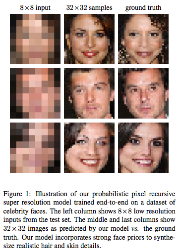
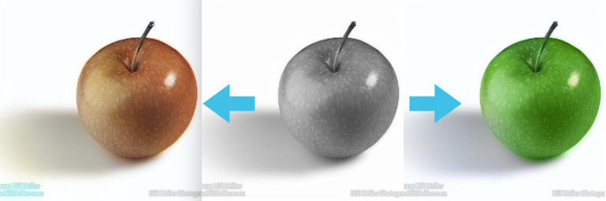
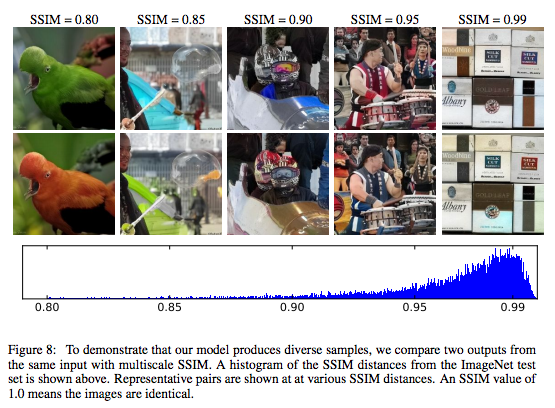
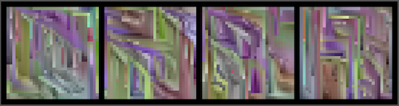

Last year, after [nerding](http://tinyclouds.org/colorize/)
[out](https://github.com/ry/tensorflow-vgg16)
[a](https://github.com/tensorflow/tensorflow/commit/555c7f7c4108ae91601dce2e2dea1ad1158d5977)
[bit](https://github.com/ry/tensorflow-resnet) on TensorFlow, I applied and was
accepted into the inaugural class of the
[Google Brain Residency Program](https://research.google.com/teams/brain/residency/).
The program invites two dozen people, with varying backgrounds in ML, to spend a
year at Google's deep learning research lab in Mountain View to work with the
scientists and engineers pushing on the forefront of this technology.

The year has just concluded and this is a summary of how I spent it.

The motivating goal/demo I have in mind is to clean up old movies and TV shows.
Imagine seeing grainy TV shows from the 90s, or black and white movies from the
1960s, in lush and colorful 4K resolution. This seems entirely plausible: we can
take good modern media and distort it to be grainy, low-resolution, or black and
white, and train a supervised model to do the reverse transformation. Training
data is practically infinite. This would be awesome.

Don't get too excited--the technology isn't there yet... but it's getting
closer.

Armed with little more than this goal, I uprooted myself from Brooklyn and
moved, [yet again](http://nodejs.org/), to the Bay Area in pursuit of
technology. I was soon spending my days chatting with ML researchers and viming
around Google's vast software infrastructure.

If you want to skip the technical bits, [jump to the conclusion](#conclusion).

## Pixel Recursive Super Resolution

As everyone knows,
[the zoom technology presented in CSI](http://i.imgur.com/i42A2.jpg) is
impossible. You cannot arbitrarily zoom into photos. However, it is possible to
present _plausible hallucinations_ of what it would look like if you enlarged
the image. Being able to crisply increase the resolution of photographs would be
a step towards my demo.

In the literature this problem is called _Super Resolution_, and it has a long
history of attempts.

Approaching this, we knew that using a
[ConvNet](http://cs231n.github.io/convolutional-networks/) with input the
low-resolution image and output the high-resolution image trained to minimize
per-pixel distance (L2) would not completely solve the problem. This kind of
loss function learns to output the average of all possible outputs&mdash;which
looks blurry. We wanted a model that could choose, given a low-res input image,
a specific, likely high-resolution image amongst all the possible enhancements.
If we were trying to "enhance" a photo of blurry tree, we would want it to
choose specific locations for the leaves and branches, even if those weren't the
true locations when the photograph was taken.

A conditional
[GAN](https://en.wikipedia.org/wiki/Generative_adversarial_networks) seemed like
it could solve this problem, but having made several failed attempts at building
GANs before, we turned to another promising new generative model called
[PixelCNN](https://arxiv.org/abs/1606.05328). (Shortly after we started on this
project, SRGAN was published which applied a GAN to the problem with great
looking results.)

PixelCNN is a strange and counter-intuitive model. It formulates image
generation as choosing a sequence of pixels, one at a time. Gated recurrent
networks like [LSTMs](http://colah.github.io/posts/2015-08-Understanding-LSTMs/)
have been [very](https://arxiv.org/abs/1409.3215)
[successful](https://research.google.com/pubs/pub45610.html) at generating
sequences--usually words or characters. PixelCNN cleverly structures a CNN to
produce exact probability distributions of pixels conditioned on previous ones.
It's a mixture between an RNN and a CNN.

<small>Figure by van den Oord et al.</small>

Surprisingly PixelCNNs generate very natural looking images. Unlike adversarial
networks, that precariously balance two objectives, this model has a single
objective, and is thusly more robust to hyperparameter changes. That is, it's
easier to optimize.

My first attempts at Super Resolution with PixelCNN were naively too ambitious,
training on large ImageNet images. (ImageNet is a difficult dataset compared to
CIFAR-10 or CelebA or LSUN, where lots of generative model research is done). It
became immediately apparent that the sequential pixel-by-pixel generation of
images was very slow. Outputting images much larger than 64x64 could take hours!
However I got some compelling results when I limited it small sizes and
restricted datasets like faces or bedrooms.

At Google, one has relatively unbounded access to GPUs and CPUs. So part of this
project was figuring out how to scale the training&mdash;because even with these
restricted datasets training would take weeks on a single GPU.

The most ideal way to distribute training is Asynchronous SGD. In this setup you
start N machines each independently training the same model, sharing weights at
each step. The weights are hosted on a separate "parameter servers", which are
RPC'd at each step to get the latest values and to send gradient updates.
Assuming your data pipeline is good enough, you can increase the number of
training steps taken per second linearly, by adding workers; since they don't
depend on each other. However as you increase the number of workers, the weights
that they use become increasingly out-of-date or "stale", due to peer updates.
In classification networks, this doesn't seem to be a huge problem; people are
able to scale training to dozens of machines. However PixelCNN seems
particularly sensitive to stale gradients--more workers with ASGD provided
little benefit.

The other method is Synchronous SGD, in which the workers synchronize at each
step, and gradients from each are averaged. This is mathematically the same as
SGD. More workers increase the batch size. But Sync SGD allows individual
workers to use smaller and faster batch sizes, and thus increase the steps/sec.
Sync SGD has its own problems. First, it requires many machines to synchronize
often, which inevitably leads to increased idle time. Second, beyond having each
machine do batch size 1, you can't increase the steps taken per second by adding
machines. Ultimately I found the easiest setup was to provision 8 GPUs on one
machine and use Sync SGD--but this still took days to train.

The other way you can take advantage of lots of compute is by doing larger
hyperparameter searches. Not sure what batch size to use? Try all of them! I
tried hundreds of configurations before arriving at the one we published.

Quantitatively evaluating the results presented another difficult problem. How
could we show that our images were better than baseline models? Typical measures
of quality in super resolution use pixel-wise distance (PSNR) between the
enhanced image and the ground truth. The faces and bedroom images we saw coming
out of the model were clearly better in quality, but when comparing pixels to
ground truth, they were, on average, farther away than the blurry outputs of the
baseline. We tried to use the likelihood measurements from PixelCNN itself to
show that it assigned higher probability to our samples vs baseline samples, but
that didn't work either. Finally we resorted to crowd sourcing human
raters--asking which images they found more real. That worked.

The result was this paper:
[Pixel Recursive Super Resolution](https://arxiv.org/abs/1702.00783)

## PixColor: Another Attempt at Colorization

<small>Two color modes outputted by PixColor.</small>

[Sergio Guadarrama](https://research.google.com/pubs/105009.html), the creator
of
[Slim](https://research.googleblog.com/2016/08/tf-slim-high-level-library-to-define.html),
had also been toying around with image colorization. He told me about an
experiment where he took a <code>224&times;224&times;3</code> image in
[YPbPr colorspace](https://en.wikipedia.org/wiki/YPbPr) (where the grayscale and
colors are split), scaled the color channels to a very low-resolution
<code>28&times;28&times;2</code> and scaled them up again using bilinear
interpolation. The resulting image looked practically indistinguishable from
from the original with high resolution colors.

This suggested that we could make the colorization problem much easier by only
attempting to predict the low-resolution colors. I had been ready to give up on
PixelCNN entirely due to its apparent inability to scale beyond small images,
but generating
<code>28&times;28&times;2</code> seemed very doable. We simplified the problem
further by quantizing the colors to 32 values instead of 256.

Sergio built a "refinement" network that could clean up the low-resolution color
output, pushing colors that bled beyond boundaries back into their proper
locations&mdash;a feed-forward image-to-image CNN trained with just L2 loss. We
also used a good pre-trained [ResNet](https://arxiv.org/abs/1512.03385) for the
conditioning network, which alliviated the need to add an extra loss term, as we
had added in the super resolution project.

With all these tricks in place, we were able to achieve state of the art results
on ImageNet as measured both by crowd sourced evaluations and by color histogram
intersection. Turns out, a properly trained PixelCNN models image statistics
very well, without any sort of mode collapse.

Since the model yields a probability distribution over possible colorizations,
for each grayscale input, we could sample from it multiple times to get multiple
colorizations of the same input. This figure nicely describes the diversity
distribution using [SSIM](https://en.wikipedia.org/wiki/Structural_similarity):

The model is still far from perfect. ImageNet, although large, is not indicative
of all images. The model has a difficult time when applied to non-ImageNet
images. We found that real black and white photographs (as opposed to color
images that were made grayscale) have different statistics, and contain
different objects not seen in color photos. For example, there probably aren't
many color photos of Model T cars, and likely none in ImageNet. These problems
could probably be mitigated with a larger dataset and better data augmentation.

To get a sense of the quality have a look at some images:

<ul>
<li>Our model with intermediate stages on
[a small set of particularly difficult images](step1326412_t100/index.html)
<li>Our model on [random ImageNet test set images](rld_28px3_t100_500_center_crop_224/)
</ul>

For comparison here are some other colorization algorithms applied to the same
ImageNet test subset:

<ul>
<li><a href="ltbc_500_center_crop_224/index.html">Let there be
    Color!</a>
  (<a
    href="http://hi.cs.waseda.ac.jp/~iizuka/projects/colorization/en/">website</a>)
<li><a href="cic_500_center_crop_224/index.html">Colorful Image
    Colorization</a>
    (<a href="http://richzhang.github.io/colorization/">website</a>)
<li><a href="lrac_500_center_crop_224/index.html">Learning
    Representations for Automatic Colorization</a>
    (<a
    href="http://people.cs.uchicago.edu/~larsson/colorization/">website</a>)
</ul>

Finally here is our paper for all the details:
[PixColor: Pixel Recursive Colorization](https://arxiv.org/abs/1705.07208)

## Negative and Unreported Experiments

During the year I was momentarily enthusiastic about many side projects that
didn't pan out... I'll describe some of them here:

### Factoring Large Numbers

[Factoring large numbers](https://en.wikipedia.org/wiki/Integer_factorization)
is a notoriously difficult and old problem. But even these days,
[new things](http://www.nature.com/news/peculiar-pattern-found-in-random-prime-numbers-1.19550)
are being discovered about the distribution of prime numbers. Perhaps deep
neural networks, given enough examples, could learn something new?
[Mohammad](https://research.google.com/pubs/MohammadNorouzi.html) and I tried
two approaches. He modified Google's Neural Machine Translation seq2seq model to
take a sequence of integers representing a large semi-prime as input and predict
one of its prime factors as output. I tried a simpler model that took a fixed
length integer input and used several fully-connected layers to classify prime
or not prime. Neither attempt learned more than the obvious patterns (if it ends
in a zero, it's not prime!), and the idea was abandoned.

### Adversarial Dreaming

Inspired by [Michael Gygli's project](https://arxiv.org/abs/1703.04363), I
wanted to see if I could have a discriminator act as its own generator. I set up
a simple binary classification CNN which decided if the input was real or fake.
To generate images, you would give it noise and have the network update the
input with gradients (sometimes called deep dreaming) so that it maximized the
"real" classification. The network is trained by alternatingly generating "fake"
examples and, like a classic GAN discriminator, updating weights to classify
real examples from fake.

The idea was that maybe this would be easier to train than a normal GAN because
you would have fewer architectural decisions. It actually kind of worked on
MNIST. Here each column is a noise image getting pushed progressively towards a
red MNIST digit.

I couldn't get it working on CIFAR-10 and it seemed of limited practical
benefit. It's too bad because "Adversarial Dreaming" would be a cool name for a
paper.

### Training a generator with a PixelCNN

Frustrated by how long it took PixelCNN to produce samples, I wanted to see if I
could train feed-forward image-to-image CNN (8x8 to 32x32 LSUN bedrooms) using a
pre-trained PixelCNN. The way I set this up was by auto-regressing on output of
the feed-forward network. The weights were updated to maximize the likelihood
under the PixelCNN. This didn't work at all. It produced weird images with line
artifacts that like this:

### Exploring Modifications to Async SGD

As I explained above, Async SGD doesn't work for many models. A recent paper
called [DCASGD](https://arxiv.org/abs/1609.08326) presents a potential fix to
the stale gradient problem by using the difference vector in weight space from
where each worker began their step to where they apply their weight. This has
the potential to be hugely beneficial to everyone's training time. Unfortunately
I was unable to repeat their results in TensorFlow, nor several similar ideas I
had on long those lines. It's likely a bug. (Contact me internally if you'd like
get my implementation.)

## Conclusion

So I'm a software engineer with not much previous experience in ML. Having just
spent the last year deep diving deep learning, I thought I would share my
general thoughts on the field, and how I see it in relation to the greater
software world.

I remain bullish that machine learning will transform essentially all industries
and eventually improve the lives of every human. There are many industrial
processes that can benefit from the smart guesses that ML provides. I believe my
motivating demo will be achieved some day soon&mdash;you will watch Charlie
Chaplin in 4K resolution and it will be indistinguishable from a modern movie.

That said, I've found it very difficult to build, train, and debug models.
Certainly much of that difficulty is just my own inexperience, but that itself
points to how much experience is needed to effectively train these beasts. My
work has been focused on the easiest branch of ML: supervised learning. Even
with perfect labels, developing models can be quite difficult. It seems the
larger the dimensionality of the prediction, the longer it will take to build
the model (like, in hours of your life spent coding and debugging and training).
I encourage anyone starting out to simplify and restrict your predictions as
much as possible. One example of this came up in our colorization work: we
started out having the model predict the entire RGB image instead of just the
color channels. The idea being that it would be easy for the network to pass the
intensity image through to the output since we were using skip connections.
Switching to only color channel predictions still improved performance.

If I use the word "working" in a subjective, gut-reaction way of describing
software: Image classification seems to work robustly. Generative models barely
work and are not well understood. GANs have great images, but are almost
impossible to build&mdash;my experience has been that any small change to the
architecture and it will just stop working. I've heard reinforcement learning is
even more difficult. I can't speak to recurrent networks.

On the other hand, it seems that SGD is so robust that even gross mathematical
errors may not make a model fail outright. They may only slightly punish
performance.

Because models often take many days to train, it is a very slow edit-run cycle.

The culture of testing has not sufficiently caught on yet. We need better ways
of asserting during training, that various parts of networks maintain certain
means and variances, don't oscillate too much, or stay within ranges. ML bugs
make the [heisenbugs](http://www.catb.org/jargon/html/H/heisenbug.html) of
[my systems past](https://github.com/libuv/libuv) seem delightfully easy.

Parallelization is of limited benefit. Large hyperparameter searches become
easier with more computers, but ideally we would have models that work without
the need for such careful tuning. (In fact, I suspect that researchers with
limited ability to do hyperparameter searches will be forced to be smarter about
their model design, and that results in more robust models.) Asynchronous SGD,
unfortunately, doesn't really help for many models. Synchronous SGD works, but
it can't increase steps/sec faster than a single machine can process one
example&mdash;more accurate gradients just don't help much usually. This is why
the <a
href="https://arxiv.org/abs/1609.08326">DCASGD</a> research direction is
important.

From a software maintenance perspective there is little consensus on how to
organize ML projects. It feels like websites before Rails came out: a bunch of
random PHP scripts with an unholy mixture of business logic and markup sprinkled
throughout. In TensorFlow projects it's an unorganized glob of data pipelining,
mathematics, and hyperparameter/configuration management. I believe a beautiful
abstraction/organization has yet to be discovered. (Or rediscovered, like how
[MVC](https://en.wikipedia.org/wiki/Model%E2%80%93view%E2%80%93controller) was
rediscovered and popularized by [DHH](https://twitter.com/dhh).) My own project
structure has been evolving, but I would not call it beautiful.

Frameworks will continue to evolve rapidly. I started with Caffe and appreciate
how much TensorFlow enabled. Now projects like PyTorch and Chainer have
delighted users with their dynamic computation graphs. The long edit-run cycle
is a major roadblock to developing better models&mdash;I suspect frameworks that
prioritize fast startup and evaluation will ultimately succeed. Despite useful
tools like TensorBoard and iPython, it remains difficult inspect what the models
are doing during training.

The signal-to-noise ratio in papers is low. There's too much volume to keep up
with. People are often not upfront about the failures of their models because
conferences prefer accuracy over transparency. I would like to see a conference
that takes blog post submissions and requires open source implementations.
<a href="http://distill.pub/">Distill</a> is a laudable effort in this
direction.

It's an exciting time for ML. There is ample work to be done at all levels: from
the theory end to the framework end, much can be improved. It's almost as
exciting as the creation of the internet. Grab a shovel!

<a href="https://xkcd.com/1838/">

<small>xkcd</small>
</a>

## Shoutouts

Many thanks to Jon Shlens and Mohammad Norouzi who guided me with countless
whiteboarding sessions and invaluable advice; David Bieber and Sergio
Guadarrama, two amazing hackers that I had the privilege of working closely
with; Martin Stumpe, Kevin Murphy, Doug Eck, Leslie Phillips; and the other
residents for commiserating when submission deadlines drew near : )
